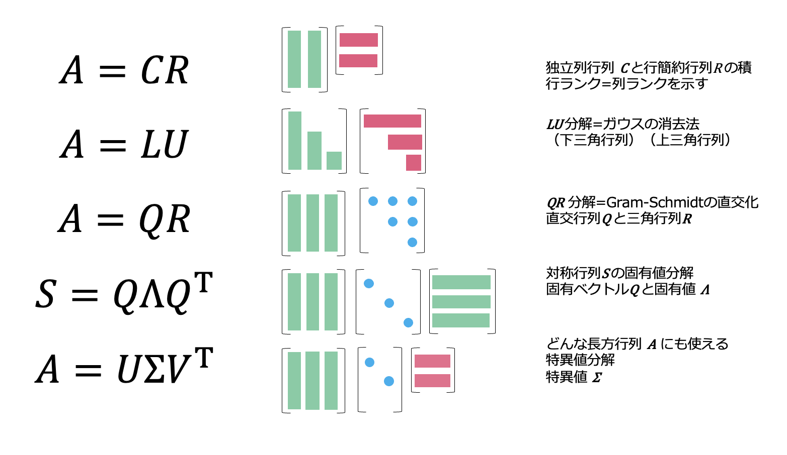
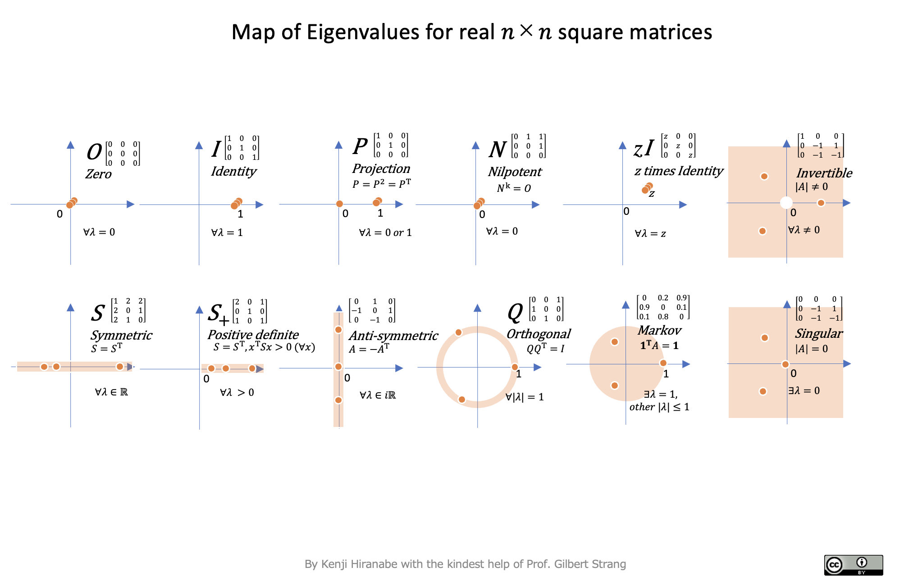
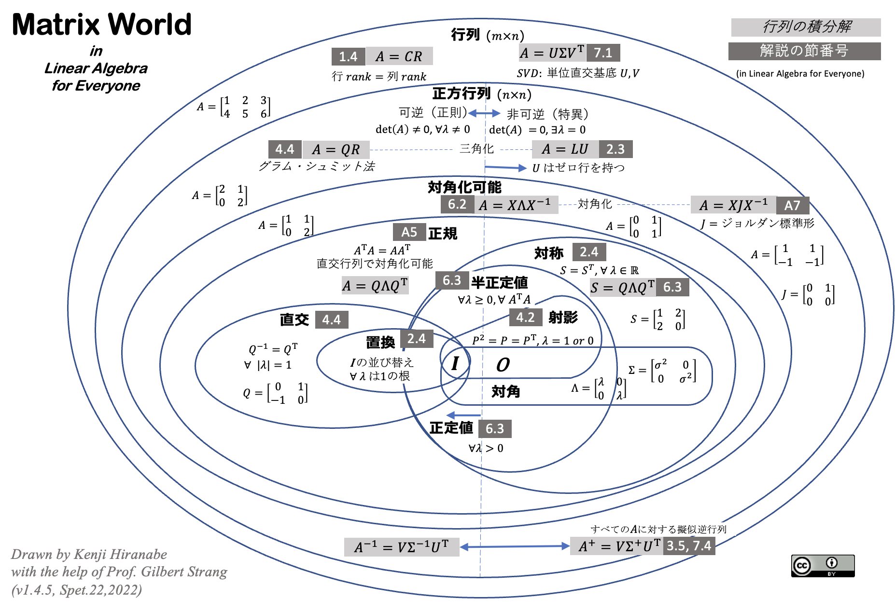

[English](README.md) | 日本語 | [中文(简体)](README-zh-CN.md)

# 線形代数のアート

Gilbert Strang 著『Linear Algebra for Everyone』の図解ノートです．ストラング先生の多大な協力を得て平鍋健児が作成しており，出力された最終 PDF ファイルは以下です．

- 英語版は，「[The-Art-of-Linear-Algebra.pdf](The-Art-of-Linear-Algebra.pdf)」です。
- 日本語版は「[The-Art-of-Linear-Algebra-j.pdf](The-Art-of-Linear-Algebra-j.pdf)」です。
- 中国語版は「[The-Art-of-Linear-Algebra-zh-CN.pdf](The-Art-of-Linear-Algebra-zh-CN.pdf)」です。最新版は「[kf-liu/The-Art-of-Linear-Algebra-zh-CN/The-Art-of-Linear-Algebra-zh-CN.pdf](https://github.com/kf-liu/The-Art-of-Linear-Algebra-zh-CN/blob/main/The-Art-of-Linear-Algebra-zh-CN.pdf)」から入手できます。

## 概要

『Linear Algebra for Everyone』で紹介されている重要な概念を、直感的に理解できるよう図解しました。行列分解の観点から、ベクトル・行列の計算やアルゴリズムの理解を深めることを目指しています。扱っている分解は、Column-Row（ $CR$ ）、ガウス消去法（ $LU$ ）、グラム・シュミット直交化（ $QR$ ）、固有値と対角化（ $Q\Lambda Q^\top$）、特異値分解（ $U\Sigma V^\top$）です。

その他の図も収録しています。

## 固有値の地図

- PDF「[MapofEigenvalues](MapofEigenvalues.pdf)」で利用できます。

## 行列の世界

- PDF「[MatrixWorld](MatrixWorld.pdf)」で利用できます。

## 書籍 📕

この論文は日本語で書籍化され，2026年に出版されました。
https://anagileway.com/visual-linear-algebra/

