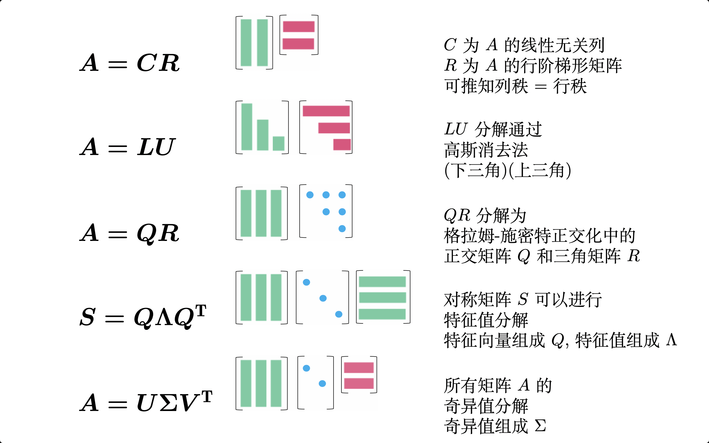
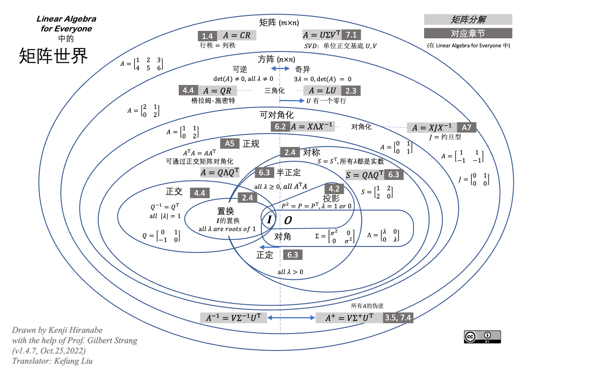

[English](README.md) ｜ 中文(简体)

# The-Art-of-Linear-Algebra

Graphic notes on Gilbert Strang's "Linear Algebra for Everyone"

图释 Gilbert Strang 的 “给每个人的线性代数”

> 中译说明:
>
> 中文版尚在翻译中, 欢迎issue提出问题或pr共建, 万分感激! 
>
> 英文与日文原版仓库为[kenjihiranabe/The-Art-of-Linear-Algebra](https://github.com/kenjihiranabe/The-Art-of-Linear-Algebra), 中文版在仓库[kf-liu/The-Art-of-Linear-Algebra-zh-CN](https://github.com/kf-liu/The-Art-of-Linear-Algebra-zh-CN)中 (也会定期提pr到英文与日文原版的仓库), 欢迎`✨star`中文版仓库以跟进最新的中文译版.

全文输出文件:

中文版本 "[The-Art-of-Linear-Algebra-zh-CN.pdf](The-Art-of-Linear-Algebra-zh-CN.pdf)" 与 中文最新版"[kf-liu/The-Art-of-Linear-Algebra-zh-CN/The-Art-of-Linear-Algebra-zh-CN.pdf](https://github.com/kf-liu/The-Art-of-Linear-Algebra-zh-CN/blob/main/The-Art-of-Linear-Algebra-zh-CN.pdf)"

英文版本 "[The-Art-of-Linear-Algebra.pdf](The-Art-of-Linear-Algebra.pdf)"

日文版本 "[The-Art-of-Linear-Algebra-j.pdf](The-Art-of-Linear-Algebra-j.pdf)"

## 摘要

我尝试为 Gilbert Strang 在书籍 “Linear Algebra for Everyone” 中介绍的矩阵的重要概念进行可视化图释, 以促进从矩阵分解的角度对向量、矩阵计算和算法的理解.
它们包括矩阵分解 (Column-Row, CR)、高斯消去法 (Gaussian Elimination, LU)、格拉姆-施密特正交化 (Gram-Schmidt Orthogonalization, QR)、特征值和对角化 (Eigenvalues and Diagonalization, QΛQ')、和奇异值分解(Singular Value Decomposition, UΣV').

也包括其他图形.

## 特征值图

- 可以在 PDF "[MapofEigenvalues](MapofEigenvalues-v1.1.pdf)"中查看

## 矩阵世界

- 可以在 PDF "[MatrixWorld](MatrixWorld.pdf)"中查看

## 许可证

英文与日文版本许可证见[原文](https://github.com/kenjihiranabe/The-Art-of-Linear-Algebra), 译者行文时, 原文版本使用 CC0-1.0 许可证.

中文版本使用许可证, 请勿商用.
