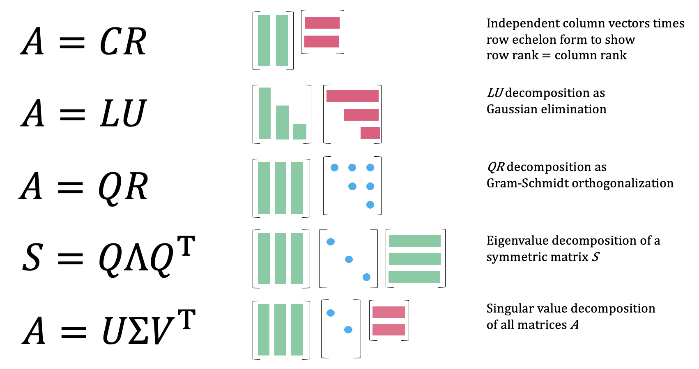
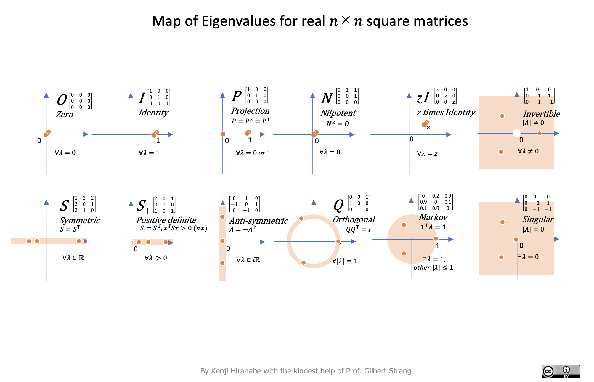
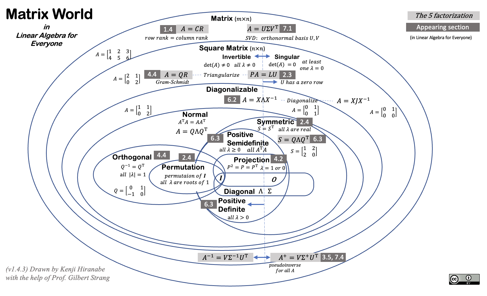

English ｜ [中文(简体)](README-zh-CN.md)

# The-Art-of-Linear-Algebra

Graphic notes on Gilbert Strang's "Linear Algebra for Everyone"

The output file is "[The-Art-of-Linear-Algebra.pdf](The-Art-of-Linear-Algebra.pdf)"

Japanese version "[The-Art-of-Linear-Algebra-j.pdf](The-Art-of-Linear-Algebra-j.pdf)"

Chinese version "[The-Art-of-Linear-Algebra-zh-CN.pdf](The-Art-of-Linear-Algebra-zh-CN.pdf)" and "[kf-liu/The-Art-of-Linear-Algebra-zh-CN/The-Art-of-Linear-Algebra-zh-CN.pdf](https://github.com/kf-liu/The-Art-of-Linear-Algebra-zh-CN/blob/main/The-Art-of-Linear-Algebra-zh-CN.pdf)" for the latest Chinese version. 

## Abstract

I tried intuitive visualizations of important concepts introduced
in "Linear Algebra for Everyone".

This is aimed at promoting understanding of vector/matrix calculations
and algorithms from the perspectives of matrix factorizations.
They include Column-Row (CR), Gaussian Elimination (LU),
Gram-Schmidt Orthogonalization (QR), Eigenvalues and Diagonalization (QΛQ'),
and Singular Value Decomposition (UΣV').

Also includes other graphics.

## Map of Eigenvalues

- Avaialble in PDF "[MapofEigenvalues](MapofEigenvalues-v1.1.pdf)"

## Matrix World

- Avaialble in PDF "[MatrixWorld](MatrixWorld.pdf)"
