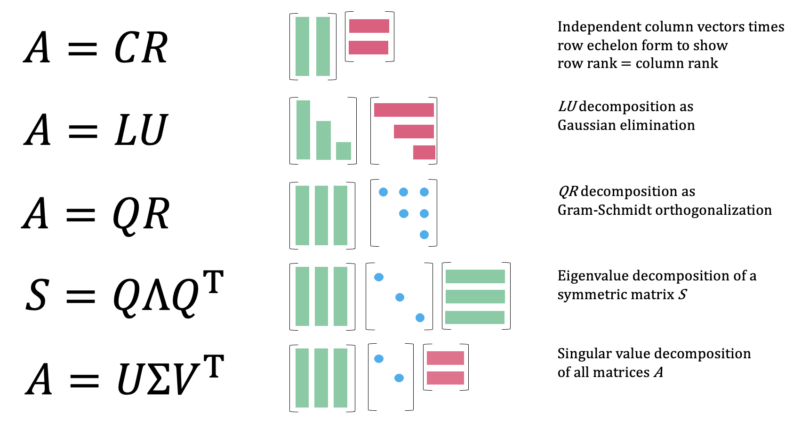
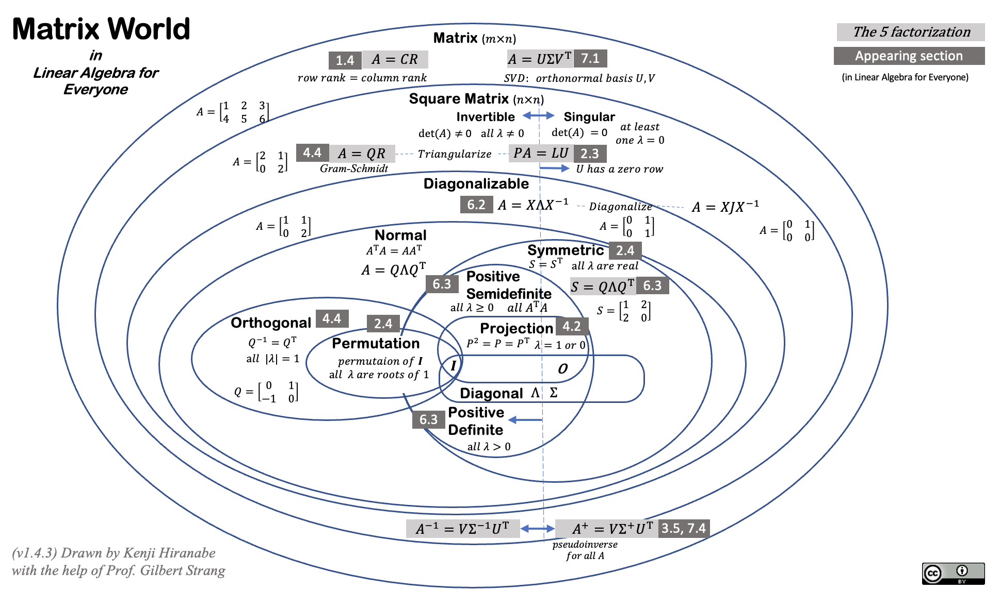

English | [日本語](README-ja.md) | [中文(简体)](README-zh-CN.md)

# The-Art-of-Linear-Algebra

Graphic notes on Gilbert Strang's "Linear Algebra for Everyone" by Kenji Hiranabe with the kindest help from Gilbert Strang. The output PDF files are listed below.

- The English version "[The-Art-of-Linear-Algebra.pdf](The-Art-of-Linear-Algebra.pdf)"
- The Japanese version "[The-Art-of-Linear-Algebra-j.pdf](The-Art-of-Linear-Algebra-j.pdf)"
- The Chinese version "[The-Art-of-Linear-Algebra-zh-CN.pdf](The-Art-of-Linear-Algebra-zh-CN.pdf)" and "[kf-liu/The-Art-of-Linear-Algebra-zh-CN/The-Art-of-Linear-Algebra-zh-CN.pdf](https://github.com/kf-liu/The-Art-of-Linear-Algebra-zh-CN/blob/main/The-Art-of-Linear-Algebra-zh-CN.pdf)" for the latest Chinese version.

## Abstract

I tried intuitive visualizations of important concepts introduced in "Linear Algebra for Everyone".

This is aimed at promoting understanding of vector/matrix calculations and algorithms from the perspectives of matrix factorizations. They include Column-Row ( $CR$ ), Gaussian Elimination ( $LU$ ), Gram-Schmidt Orthogonalization ( $QR$ ), Eigenvalues and Diagonalization ( $Q\Lambda Q^\top$), and Singular Value Decomposition ( $U\Sigma V^\top$ ).

Also includes other graphics.

## Map of Eigenvalues

- Available in PDF "[MapofEigenvalues](MapofEigenvalues.pdf)"

## Matrix World

- Available in PDF "[MatrixWorld](MatrixWorld.pdf)"

## The Book 📕
The Japanese book of this paper has been published in 2026. Let me know if overseas publishers are interested in publishing this in English.
- https://anagileway.com/visual-linear-algebra/

